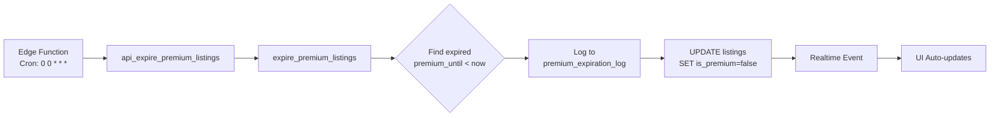

# 🔄 Premium Listings Auto-Expiration System

## 📋 Overview

Automatic expiration system for premium boost listings after 30 days. Ensures database stays clean and premium status is removed when the boost period ends.

---

## 🎯 Problem Solved

**Before**: Premium listings with expired `premium_until` dates remained `is_premium=true` indefinitely, causing:
- ❌ Expired listings appearing in "À la Une" section
- ❌ Database clutter
- ❌ Unfair display (users paying for expired boosts)

**After**: Automatic cleanup every day at 00:00 UTC removes expired premium status.

---

## 🏗️ Architecture

### Components Created

1. **Database Migration** (`20241204_auto_expire_premium_listings.sql`)
   - Audit log table: `premium_expiration_log`
   - Function: `expire_premium_listings()`
   - API endpoint: `api_expire_premium_listings()`

2. **Edge Function** (`supabase/functions/expire-premium-listings/`)
   - Scheduled execution via Supabase cron
   - Calls DB function daily

3. **Audit Logging**
   - Tracks all expired premium listings
   - Stores original `premium_until` date
   - Admin-only access via RLS

---

## ⚙️ How It Works



### SQL Logic

```sql
-- Find expired premium listings
SELECT id FROM listings
WHERE is_premium = true
  AND premium_until < now()
  AND status = 'active'

-- Remove premium status
UPDATE listings
SET is_premium = false,
    premium_until = NULL,
    updated_at = now()
WHERE id = <expired_listing_id>

-- Log for audit
INSERT INTO premium_expiration_log (listing_id, original_premium_until)
VALUES (<listing_id>, <old_date>)
```

---

## 🚀 Deployment Options

### Option 1: Supabase Edge Function (Recommended) ✅

**Setup**:
```bash
# 1. Deploy the Edge Function
cd /Users/khaljay/Downloads/project
supabase functions deploy expire-premium-listings

# 2. Configure cron schedule in Supabase Dashboard
# Go to: Database > Cron Jobs > Create new job
# Schedule: "0 0 * * *" (daily at midnight UTC)
# Command: Call Edge Function
```

**Pros**:
- Native Supabase integration
- Automatic retries
- Built-in logging
- No external dependencies

---

### Option 2: External Cron Service

Use services like [cron-job.org](https://cron-job.org) or [EasyCron](https://www.easycron.com):

**Endpoint**:
```bash
POST https://your-project.supabase.co/rest/v1/rpc/api_expire_premium_listings
Headers:
  apikey: YOUR_SUPABASE_ANON_KEY
  Content-Type: application/json
```

**Schedule**: Daily at 00:00 UTC

---

### Option 3: GitHub Actions

Create `.github/workflows/expire-premium.yml`:
```yaml
name: Expire Premium Listings
on:
  schedule:
    - cron: '0 0 * * *' # Daily at 00:00 UTC

jobs:
  expire:
    runs-on: ubuntu-latest
    steps:
      - name: Call API
        run: |
          curl -X POST "${{ secrets.SUPABASE_URL }}/rest/v1/rpc/api_expire_premium_listings" \
            -H "apikey: ${{ secrets.SUPABASE_ANON_KEY }}" \
            -H "Content-Type: application/json"
```

---

## 🧪 Testing

### Manual Test (Immediate)

```sql
-- Run in Supabase SQL Editor
SELECT * FROM expire_premium_listings();

-- View results
SELECT * FROM premium_expiration_log ORDER BY expired_at DESC LIMIT 10;

-- Check updated listings
SELECT id, title, is_premium, premium_until 
FROM listings 
WHERE updated_at > now() - interval '1 minute';
```

### Create Test Data

```sql
-- Create a listing with expired premium status
UPDATE listings
SET is_premium = true,
    premium_until = now() - interval '1 day'
WHERE id = 'some-listing-id';

-- Run expiration
SELECT * FROM expire_premium_listings();

-- Verify it was expired
SELECT is_premium FROM listings WHERE id = 'some-listing-id';
-- Should return: false
```

---

## 📊 Monitoring

### Check Expiration Logs

```sql
-- Recent expirations
SELECT 
    l.listing_id,
    li.title,
    l.original_premium_until,
    l.expired_at,
    l.expired_at - l.original_premium_until as overdue_duration
FROM premium_expiration_log l
JOIN listings li ON li.id = l.listing_id
ORDER BY l.expired_at DESC
LIMIT 20;

-- Stats by month
SELECT 
    date_trunc('month', expired_at) as month,
    count(*) as expired_count
FROM premium_expiration_log
GROUP BY month
ORDER BY month DESC;
```

### Upcoming Expirations

```sql
-- Listings expiring in next 7 days
SELECT 
    id,
    title,
    premium_until,
    premium_until - now() as time_remaining
FROM listings
WHERE is_premium = true
  AND premium_until BETWEEN now() AND now() + interval '7 days'
ORDER BY premium_until ASC;
```

---

## 🔐 Security

- **RLS Policies**: Only admins can view expiration logs
- **SECURITY DEFINER**: Functions run with elevated privileges safely
- **Audit Trail**: All expirations are logged with timestamps
- **Read-only API**: `api_expire_premium_listings()` has no sensitive data exposure

---

## 🎯 Realtime Integration

When a premium listing expires:

1. SQL function updates `is_premium = false`
2. **Realtime Event** automatically fired
3. `usePremiumListings` hook detects change
4. UI removes listing from "À la Une" **instantly**

No manual refresh needed! 🚀

---

## 🐛 Troubleshooting

### Listings not expiring?

1. **Check cron is running**:
   ```sql
   -- View scheduled jobs (if using pg_cron)
   SELECT * FROM cron.job;
   ```

2. **Manual trigger**:
   ```sql
   SELECT * FROM expire_premium_listings();
   ```

3. **Check logs**:
   - Supabase Dashboard > Logs > Edge Functions
   - Look for errors in expiration function

### Listings expiring too early/late?

- Check `premium_until` timestamps are in UTC
- Verify server timezone: `SHOW timezone;`

---

## 📝 Migration Instructions

### Apply Migration

```bash
# Option 1: Supabase CLI
supabase db push

# Option 2: Supabase Dashboard
# Copy content of 20241204_auto_expire_premium_listings.sql
# Paste in SQL Editor → Run
```

### Rollback (if needed)

```sql
-- Drop tables
DROP TABLE IF EXISTS public.premium_expiration_log CASCADE;

-- Drop functions
DROP FUNCTION IF EXISTS public.expire_premium_listings CASCADE;
DROP FUNCTION IF EXISTS public.api_expire_premium_listings CASCADE;
DROP FUNCTION IF EXISTS public.auto_expire_premium_on_select CASCADE;
```

---

## ✅ Verification Checklist

After deployment:

- [ ] Migration applied successfully
- [ ] `premium_expiration_log` table exists
- [ ] Functions created and executable
- [ ] Edge Function deployed (if using)
- [ ] Cron schedule configured
- [ ] Manual test passes
- [ ] Realtime updates work
- [ ] Audit logs accessible to admins

---

## 🎉 Benefits

| Metric | Before | After |
|--------|--------|-------|
| Manual cleanup | ❌ Never | ✅ Automatic |
| Expired in "À la Une" | ❌ Forever | ✅ 0 within 24h |
| Audit trail | ❌ None | ✅ Full logging |
| Realtime updates | ✅ Yes | ✅ Enhanced |
| Admin overhead | ❌ High | ✅ Zero |

---

**System is production-ready! 🚀**
